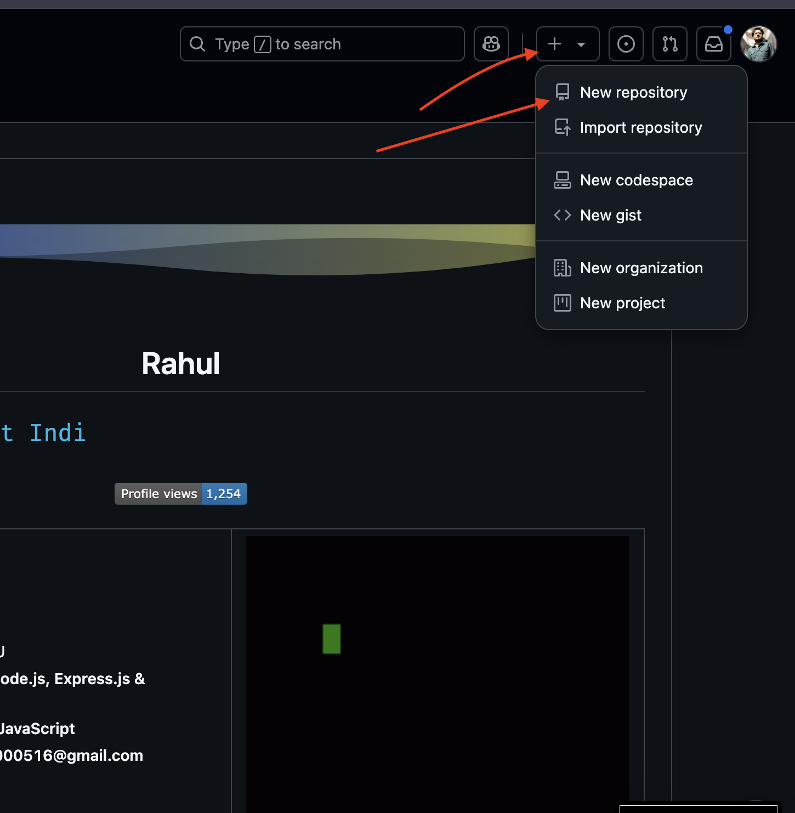
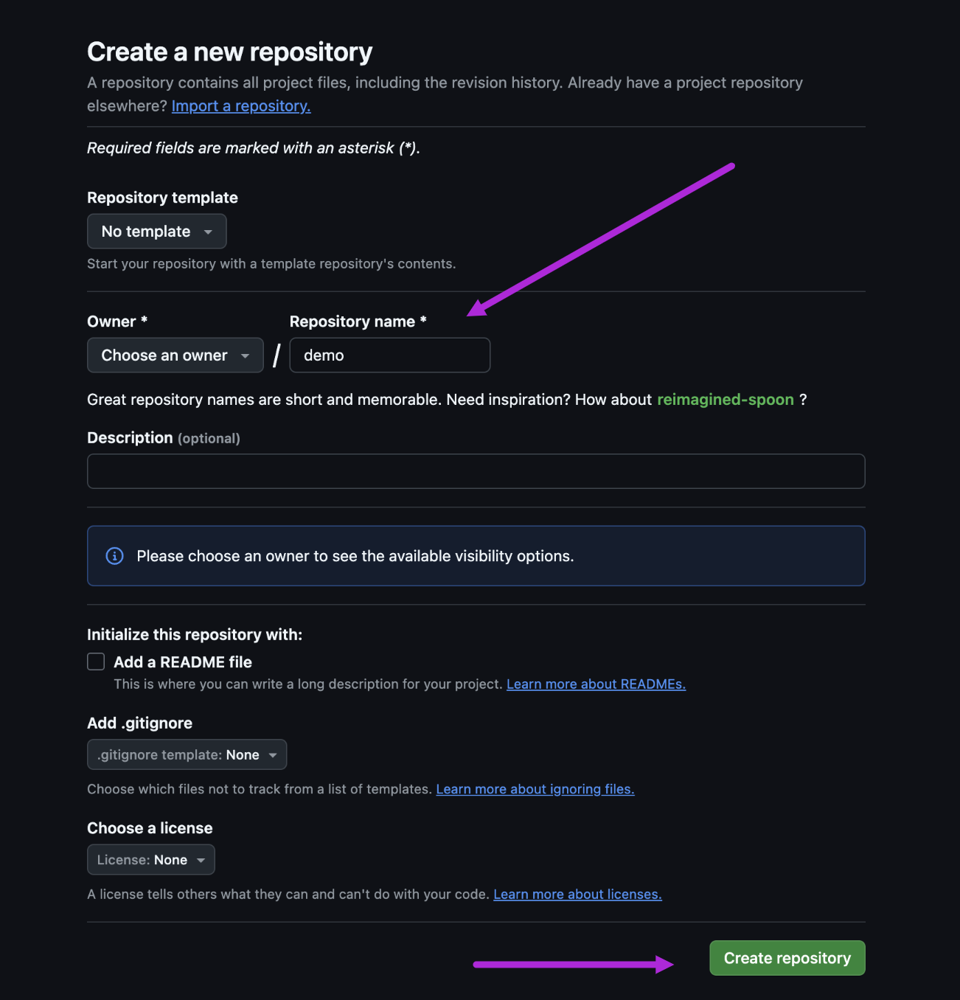
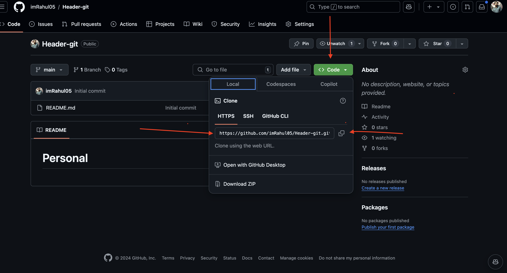

# How to Setup GitHub Repo

This guide will walk you through the steps to set up a GitHub repository.

## Table of Contents

- [Step 1: Create a New Repository](#step-1-create-a-new-repository)
- [Step 2: Set Up GitHub Repo](#step-2-set-up-github-repo)
- [Step 3: Copy the Remote Repository URL](#step-3-copy-the-remote-repository-url)
- [Step 4: Navigate to Your Project Directory](#step-4-navigate-to-your-project-directory)
- [Step 5: Initialize a New Git Repository](#step-5-initialize-a-new-git-repository)
- [Step 6: Add Your Files to the Staging Area](#step-6-add-your-files-to-the-staging-area)
- [Step 7: Commit Your Changes](#step-7-commit-your-changes)
- [Step 8: Push Your Changes to the Remote Repository](#step-8-push-your-changes-to-the-remote-repository)
- [Step 9: Verify the Changes on GitHub](#step-9-verify-the-changes-on-github)

## Step 1: Create a New Repository

Go to your GitHub account and click on the "New" button to create a new repository.



## Step 2: Set Up GitHub Repo

Set up your GitHub repository by following the instructions.



## Step 3: Copy the Remote Repository URL

Go to the code button inside your repo and copy the HTTPS link.



## Step 4: Navigate to Your Project Directory

Use the `cd` command to navigate to the directory of your project.

```sh
cd your-project-directory
```

## Step 5: Initialize a New Git Repository
Initialize a new Git repository in your project directory using the following command:
```sh
git init
```
## Step 6: Add Your Files to the Staging Area

Add all the files in your project directory to the staging area using the following command:

```sh
git add .
```

## Step 7: Commit Your Changes

Commit your changes with a meaningful commit message using the following command:
```sh
git commit -m "Initial commit"
```

## Step 8: Push Your Changes to the Remote Repository

Push your changes to the remote repository using the following command:
```sh
git push -u origin main
```
